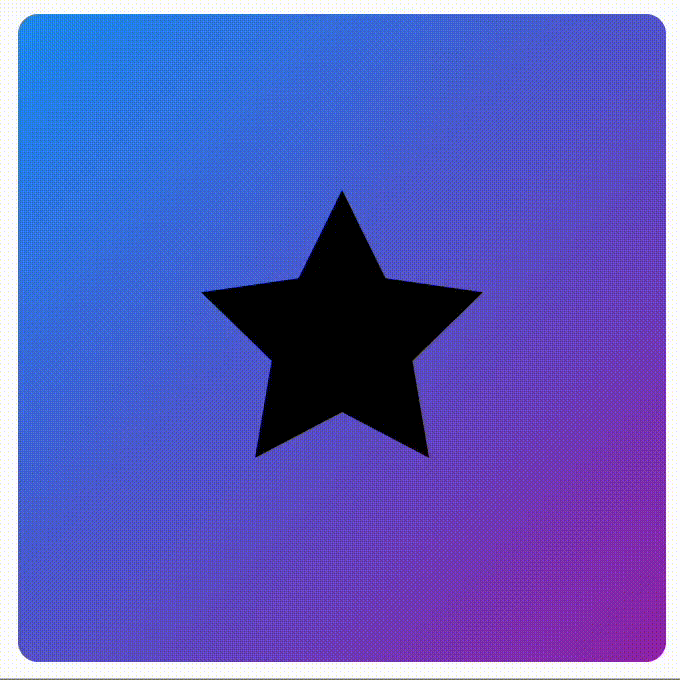

# ✨ GlowingWidget 🔥

A fun, customizable Flutter widget that adds a **glow effect** to any widget! Perfect for making your UI pop. 💡

## 🚀 Features
✔️ Easy to use  
✔️ Fully customizable glow color & intensity  
✔️ Works with any widget

## 📦 Installation
Add to your `pubspec.yaml`:
```yaml
dependencies:
  my_glowing_widget: latest_version
```

## 🛠️ Usage
```dart
import 'package:my_glowing_widget/my_glowing_widget.dart';

GlowingWidget(
  glowColor: Colors.blue,
  blurRadius: 10.0,
  child: Text("Glowing Text!"),
);
```

## 🎨 Customization
```dart
GlowingWidget(
  glowColor: Colors.purple,
  shadowColor: Color(0xFFAABD41),
  blurRadius: 15.0,
  spread: 1.5,
  sizw: Offset(100, 130),
  onTap: () => Function(),
  child: Icon(Icons.star, size: 50),
  shadowDuration: Duration(milliseconds: 300),
);
```

## 🎥 Preview

•	Showcase: 


•	Test on a star: 



## 🌟 Why Use this Widget ?

_Because everything looks cooler when it glows! 😎_

-------------------
👾 Made with ❤️ by [Punkachu](https://github.com/Punkachu)

🛠 Contributions welcome! PRs & stars are always appreciated. ⭐